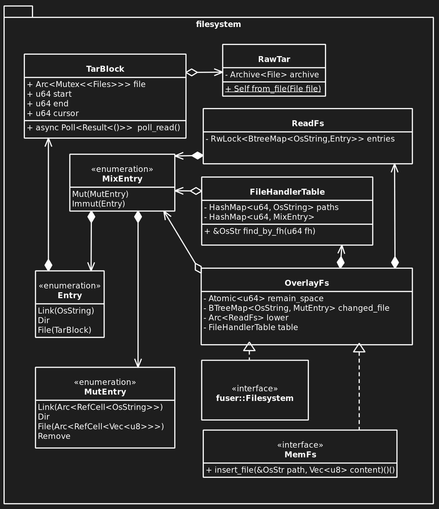

Add `FUSE`
- Use chain of responsibility for main part of UML

**Rework `lang`**
- write user-submitted code to `MemFs`, ~~preserve backward compatibility if possible~~
- write detail method for `LangCtx`, `ExecCtx` and `CompileCtx`.
- should move arguments-passing logic to `ExecCtx` and `CompileCtx`(it's a tradeoff between coupling many class or coupling two interface, ei: split functiuon from `ProcCorpse`)
**Rework `adapter`**
- connect interface realization of `lang` with remote client, mainly handle asynchronous task
**Rework `sandbox`**
- Providing strict bound for `semaphore`, consider memory limit, filesystem limit and output limit.
- Maybe there should be a interface for asynchronous streaming

